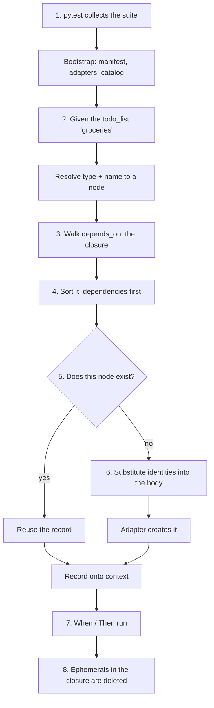

# Life of a run

This page follows one scenario from the moment pytest starts to the moment its resources are torn
down. It is the sequence everything else in ATF hangs off: if you understand this page, the catalog
keys, the adapter methods and the cockpit's states all stop being arbitrary.

The scenario:

```gherkin
Scenario: A list carries only open tasks
  Given the todo_list "groceries"
  And the task "milk"
  When I read the tasks on the list
  Then the tasks that came back are all open
```

Nothing here says "create a list". The first two lines *declare* what must exist.

## The sequence



The rest of this page walks that diagram one box at a time.

## 1. Collect {#collect}

`pytest_plugins = ["atf.spec.plugin"]` in the root `conftest.py` makes pytest import ATF's plugin, and
importing it **bootstraps the suite**: the manifest is located and parsed, every `*_env` pointer is
read from the environment, an adapter is built for each system configured in the active
environment, and the catalog is loaded and validated.

All of that happens while pytest is still collecting, before a single test runs. It is why a
missing environment variable or a catalog typo breaks collection of the whole suite rather than
failing one test — and why `atf status` is the fastest way to see such an error on its own.

Collection also generates one pytest fixture per resource type. A catalog with `owner`, `todo_list`
and `task` in it produces fixtures called `owner`, `todo_list` and `task`, each a callable taking an
instance name.

## 2. Resolve the node {#resolve-the-node}

`Given the todo_list "groceries"` matches a single generic step,
`the {resource_type} "{name}"`. It looks up the type in the catalog and then finds the instance:
type `todo_list` plus name `groceries` resolves to the node id `lists.groceries`.

A type that is not in the catalog fails the test and lists the types that are. A name with no
matching instance raises `UnknownResource`. Both are catalog problems, and both say so.

Note what the step does *not* need: the collection name. You write the type and the instance name;
ATF finds the file.

## 3. Walk the dependencies {#walk-the-dependencies}

The node's `depends_on` list is followed transitively. `lists.groceries` depends on
`owners.primary`, which depends on nothing, so the [closure](glossary.md#closure) is those two
nodes.

The closure is what gets provisioned — not just the node you named. This is the reason
`Given the task "milk"` can be the only line in a scenario and still produce a list and an owner
underneath it.

## 4. Sort it, dependencies first {#topological-sort}

The closure is topologically sorted, so a node is always attempted after everything it depends on.
Cycles cannot reach this point: the catalog refuses to load if the dependency graph has one, and
says which nodes form it.

## 5. Find or create each node {#find-or-create}

Each node in order is handed to the adapter for its system, and exactly one of these happens:

- **`exists`** — the adapter's `find` returned a record. It is used as-is.
- **`created`** — `find` returned nothing, so `create` was called.
- **`reference`** — the type is [reference mode](glossary.md#reference-mode); `find` is called and
  `create` never is. Nothing found means failure.
- **`unsupported`** — no adapter is configured for that system in this environment.
- **`error`** — the adapter raised.
- **`blocked`** — something this node depends on did not provision, so it was not attempted.

`find` is what makes a re-run safe. The adapter matches on the type's
[natural key](glossary.md#natural-key), so the second run recognises what the first one made. An
[ephemeral](glossary.md#ephemeral) node skips the lookup entirely — it is meant to be new every
time.

The first failure ends the pass. Provisioning failures are usually correlated — a bad token, an
unreachable backend — so one clear error beats two hundred identical ones.

## 6. Substitute identities {#substitute-identities}

Just before a node is created, the `${...}` [placeholders](glossary.md#placeholder) in its body are
resolved:

```yaml
groceries:
  resource: todo_list
  depends_on: [owners.primary]
  body:
    slug: groceries
    owner_id: ${owners.primary.id}
```

By the time `lists.groceries` is attempted, `owners.primary` has already been found or created in
step 5, so its real identity is known and goes into `owner_id`. This is the whole reason for the
ordering: a dependency exists before anything needs to point at it.

An identity ATF has not seen in this pass is looked up live rather than assumed missing. A
placeholder that still cannot be resolved raises `Unresolved`, which the engine reports as that
node's failure.

## 7. Run the steps {#run-the-steps}

The record the adapter returned is assigned to `context.<resource_type>` — `context.todo_list`,
`context.task` — and the `When` and `Then` steps run. That code is yours: it calls your system
through your own client fixture and asserts on the answer.

ATF does not inspect the record. Its field names are a contract between your suite and your own
backend, which is why `context.task["uuid"]` works without ATF knowing that `task` has a `uuid`.

## 8. Tear down the ephemerals {#tear-down}

After every test, an autouse fixture deletes the ephemeral resources this scenario provisioned —
including ones reached through a dependency rather than named in a step.

Deletion is best-effort: a failing `delete` is logged and the run continues. A test that passed has
told you something true, and a broken cleanup endpoint should not overturn that verdict.

Persistent resources are left exactly where they are. That is the point of them: the next run finds
them, and when a test fails you can go and look at the data it failed on.

## What this means in practice

- **A scenario's `Given` lines are a declaration, not a script.** Reordering them changes nothing;
  the dependency graph decides the order.
- **Provisioning is a read before it is a write.** Every pass starts by asking the environment what
  is already there, which is why `atf status` can answer the same question without changing
  anything.
- **Nothing is tracked in a state file.** ATF compares the catalog to the live environment every
  time. That is what makes a half-provisioned environment safe to run against.
- **The engine never branches per system.** Steps 3 to 6 are the same for a REST API, a queue and a
  three-call signup flow; only the adapter differs.

## Where to go next

- [Glossary](glossary.md) — every word used above, defined once.
- [About the model](the-model.md) — why resources, scenarios, tests and fixtures are separate
  things.
- [How to diagnose a failing provision](../how-to/diagnose-a-failing-provision.md) — when step 5
  goes wrong.
- [Specs and fixtures reference](../reference/specs-and-fixtures.md) — the exact surface of steps 1,
  2 and 7.
